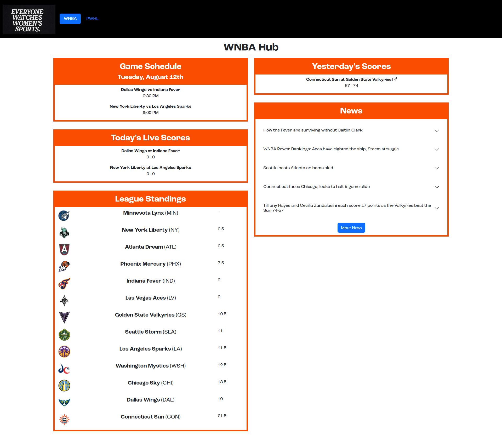

# Sports Hub
This is a project where the eventual goal is to have a hub of Professional Women's sports scores, stats, standings, schedules, etc. Everyone watches women's sports - now let's get into it! 

## Demo
For a live demo (so you don't have to get your own API key and set it up locally) please see: [https://sports-hub-uzrr.onrender.com/](https://sports-hub-uzrr.onrender.com/). (This might take up to a minute to load depending on when the last render was.)

## Setup Instructions

1. Clone the repository:
    ```bash
    git clone https://github.com/gnemzek/sports-hub.git
    cd your-repo-name
    ```

2. Create and activate a virtual environment:
    ```bash
    python3 -m venv venv
    source venv/bin/activate  # On Linux/Mac
    # or
    venv\Scripts\activate     # On Windows
    ```

3. Install dependencies:
    ```bash
    pip install -r requirements.txt
    ```

4. Set the Flask app environment variable  
   _(Flask needs to know your entry file; here it’s `main.py`.)_
    ```bash
    export FLASK_APP=main.py      # On Linux/Mac
    # or
    set FLASK_APP=main.py         # On Windows
    ```

5. (Recommended) Enable debug mode for development:
    ```bash
    export FLASK_ENV=development  # On Linux/Mac
    # or
    set FLASK_ENV=development     # On Windows
    ```
6. Get API Key from [Rapid API](https://rapidapi.com/belchiorarkad-FqvHs2EDOtP/api/wnba-api)

7. Replace ```api_key``` inside main.py with your API key. You can also set it up in an .env file. This is reccomended if you are going to put your code anywhere that isn't local. 

8. Run the Flask development server:
    ```bash
    flask run
    ```
9. Open your browser and navigate to  
   [http://localhost:5000/](http://localhost:5000/)

## Screenshots

